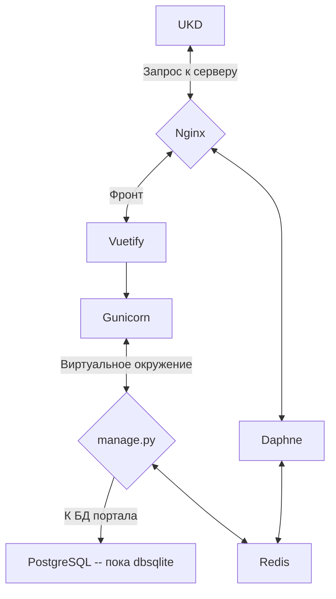

# IS#09 Сервис УКД


Информация по ненормализованным данным в АИС

http://ukd/

Каталог DQM

ПОка не инициализирован на серверах.


Сервер 28 = Прод

60= Тест


## Стэк ##
1. Python 3.8
2. Vuetify2
3. POSTGRESQL
4. Redis

## Особенности веток ##
main: prod

razrab:test
## Схема ##

стрелки надо передумать




## Установка и настройка ##

### Первоначальная установка после клонирования в папку. В случае неисправностей, идти примерно по этому же пути ###

1. В каталоге проекта Создаем окружение

``` python -m venv env ```

2. Активируем окружение

``` source env/bin/activate```

3. устанавливаем необходимые пакеты

``` cd sys ```
```pip install -r r.txt --proxy= http://...```


5. 
    Прописываем подключения в settings.py
    

6. Для проверки запускаем сервер разработки

```python manage.py runserver```

Если в консоли не появляются ошибки и сервер стартует, переходим далее. В противном случае - доустанавливаем необходимые пакеты.

 7. останавливаем сервер разработки (CTRL+C)

На этом работы непосредственно с бэкэндом завершены
### Порты ###

###  Настройка NGINX, GUNICORN, Vuetify, Daphne ###
 В каталоге sys расположены примерные файлы конфигов для тестового и боевого серверов

При копировании убедиться, что пути соответствуют системе
 #### NGINX Vuetify ####
 Стандартный путь для файлов .conf 
 /etc/nginx/sites-enabled


#### GUNICORN, Daphne ####

Файлы .service кладем в каталог /etc/systemd/system

